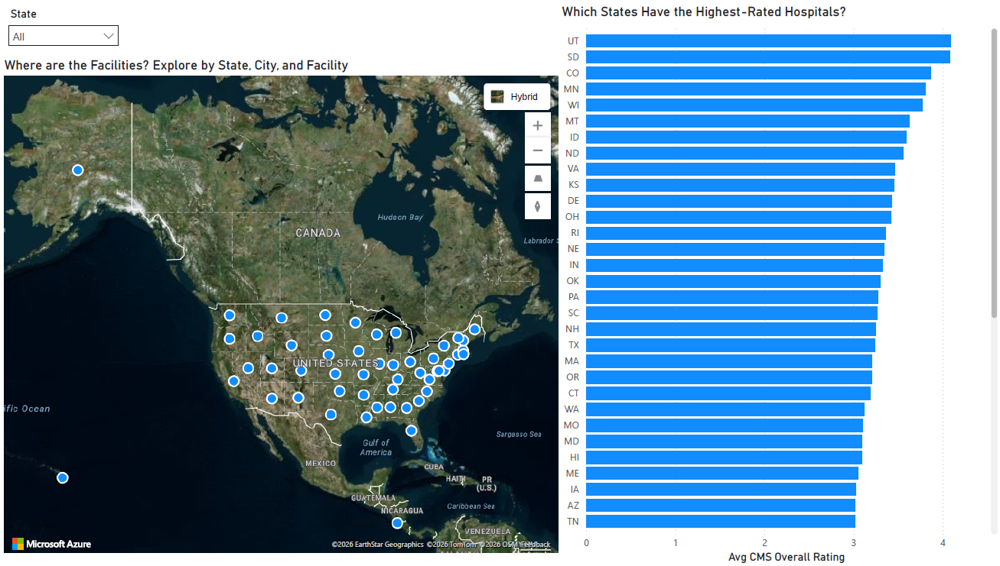
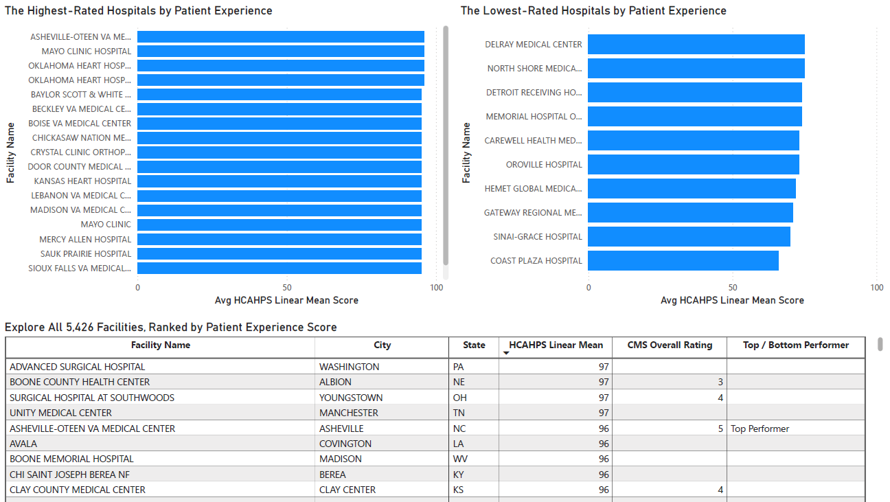

# Do Happy Patients Mean Better Care?

*A PostgreSQL + Power BI analysis of CMS Hospital Compare data*

## Project Overview

Do hospitals that patients rate highly on experience also perform better on clinical quality outcomes — and does that relationship vary by state or hospital ownership type?

This project tests that question using two independent federal measures: HCAHPS, a patient-reported survey of the care experience, and the CMS Overall Star Rating, a nine-step composite of clinical quality measures that are peer-grouped and standardized via K-means clustering (Comprehensive Methodology Report v5.0). Because the two are produced by entirely different methods, any relationship between them is a real signal rather than a methodological artifact.

Short answer: yes, moderately. Average CMS star rating rises at every HCAHPS star level (1.5 → 3.9 from 1-star to 5-star), the gap holds at the extremes (83.3 vs 90.6 average linear mean for 1-star vs 5-star facilities), but the relationship is far from 1:1. This is what you'd expect when the two measures capture genuinely different things.

## Tech Stack

- PostgreSQL
- Power BI
- Azure Maps
- Git/GitHub

## Key Findings

- **Positive but moderate correlation.** Average CMS Overall Star Rating increases stepwise at every HCAHPS Summary Star Rating level (1.5 → 2.3 → 3.1 → 3.6 → 3.9). The relationship is consistent and monotonic, but not 1:1; 5-star HCAHPS facilities average only 3.9 on the CMS scale, reflecting that the two measures are derived through fundamentally different methodologies.

- **The pattern holds at the extremes.** CMS 5-star facilities average 90.6 on the HCAHPS linear mean; 1-star facilities average 83.3 — a 7.3-point gap on a scale where the national average is 87.9.

- **Communication about medicines is the weakest link.** It scores the lowest nationally (76.5 average linear mean) with one of the highest standard deviations (4.8), meaning some facilities are doing notably better or worse than the norm. Nurse communication scores highest (91.2) and is the most consistent (stddev 2.6).

- **Ownership type matters, but less than you may think.** All three groups (For-Profit, Government, Non-Profit) cluster within a narrow band — 85.5 to 88.6 on the linear mean. For-Profit is lowest on both measures (2.7 stars, 85.5 linear mean), but with only 463 facilities behind that average compared to 1,829 Non-Profit facilities, there's more uncertainty around it.

## Data Architecture

Data flows through three schemas in a single PostgreSQL database: staging → core → mart.

- **staging** — raw loads of the four CMS source files, plus an *import_log* audit table recording every procedure run
- **core** — conformed tables: *dim_hospital_info* (one row per facility, 5,426), *fact_survey_response* (one row per facility per HCAHPS measure, 325,652 rows, with a derived *response_type* column that keeps analytical questions from repeating `LIKE '%_STAR_RATING'`), a footnote reference table, and two bridge tables that unpivot CMS's comma-separated footnote fields
- **mart** — four reporting views at facility grain. This is the layer Power BI uses and keeps the report from any future changes in *core*.

The mart is a small star schema: *vw_dim_facility* is the anchor dimension, and three fact views relate to it via *facility_id*. Power BI connected to the four views in import mode and auto-detected the relationships — no model changes were needed.


| View | Rows | Grain | Population |
|---|---|---|---|
| vw_dim_facility | 5,426 | 1/facility | Full CMS General Information universe (static attributes only) |
| vw_rating_comparison | 3,308 | 1/facility | At least one of the two star ratings exists |
| vw_hcahps_star_ratings | 43,101 | 1/facility/measure | 4,789 HCAHPS-participating facilities × 9 measures (8 + summary) |
| vw_top_bottom_performers | 5,426 | 1/facility | All facilities, nulls preserved |

**How the populations reconcile** (validated during the build): 2,741 facilities have both ratings — the analytical population for the correlation analysis. Add 442 HCAHPS-only and 125 CMS-only facilities and you get exactly 3,308 rows in the comparison view. The remaining gaps are structural, not missing data: 637 facilities don't participate in HCAHPS at all, only 3,183 of the participants clear CMS's 100-survey minimum for a HCAHPS star rating, and only 2,866 facilities meet CMS's minimum reporting thresholds for an Overall Star Rating (Step 6 of the methodology; DoD hospitals never receive one).

ETL is five stored procedures using a full-reload pattern (truncate in reverse dependency order, insert in forward order). It's designed for annual full reloads of this snapshot data; incremental loading by date range would be the natural extension if multi-year analysis ever becomes the goal.

## Dashboard Walkthrough

### Geographic Overview



An Azure Maps visual drills state → city → facility (using address and ZIP for geocoding accuracy), cross-filtered by a bar chart of average CMS Overall Star Rating by state. The map is deliberately a pure spatial index — it shows where facilities are, while state-level comparison lives in the bar chart. Six government-owned U.S. territory facilities are deliberately kept on the map rather than filtered out.

### Rating Comparison


The centerpiece: a matrix crossing CMS Overall Star Rating against HCAHPS Summary Star Rating with facility count in the cells and darker shading for denser combinations. It visualizes the stepwise correlation directly — every step up in patient rating pairs with a higher average CMS rating — and shows how much population backs each cell. Alongside it, a clustered bar chart compares average CMS and HCAHPS ratings across ownership types (For-Profit / Government / Non-Profit) with drill-down into CMS's finer ownership sub-categories.

### Top vs Bottom Performers



Two matched-axis (0–100) bar charts rank facilities by HCAHPS linear mean score — a continuous 54–100 scale rather than star ratings, which are too coarse to order individual facilities. Top performers (CMS 5-star) average 90.6 vs 83.3 for bottom performers (CMS 1-star), a 7.3-point gap on a scale where the national average sits at 87.9. A sortable 5,426-row table underneath lets a reviewer jump to any facility.

## Key Design Decisions & Lessons Learned

**Anchoring on a dimension: 5 views became 4.**
My first five mart views were each scoped to one visual. That surfaced a population mismatch: the geo view included any HCAHPS-participating facility (4,789), while the comparison and ownership views required at least one rating to exist (3,308). Related in Power BI, they would have silently dropped facilities depending on which view anchored the relationship. The fix was *vw_dim_facility* — a true dimension built from *core.dim_hospital_info* covering the full 5,426-facility universe with static attributes only (geography, ownership type). I verified *facility_id* uniqueness (0 duplicates) before building on it, and deliberately left ratings out of it: a star rating is a point-in-time fact, not a static attribute. Once static attributes lived in one place, two of the original views became pure duplicates — *vw_ownership_ratings* and *vw_geo_facility_ratings*. I retired both, kept the original SQL in the repo, and documented why. I think leaving the iteration in the repo matters to show the model was corrected while working through this project.

**One visual can't do two grains.**
I initially wanted a single Azure Maps visual that both drilled down state → city → facility as individual points and shaded each state by average CMS rating. It kept failing, and the reason is a grain mismatch: drill-down needs row-level data (one point per facility), while Legend shading needs exactly one resolvable value per state. Dropping the raw per-facility field into Legend produced no shading at all — Power BI couldn't reduce many values to one color. The fix was to stop asking one visual to do two jobs: the map is a spatial drill-down index, and state-level comparison moved to a bar chart that handles aggregation natively.

**Simple averages, no weighting variable.**
Every "average by category" visual uses a simple mean, which means that small categories can have a big impact from one or two facilities — American Samoa at the state level, "Department of Defense" as an ownership sub-type, or the 95 facilities backing the 5-star HCAHPS average. These charts are best read with the facility-count context that's always displayed next to them, not as apples-to-apples comparisons across category sizes.

**Star ratings for comparison, linear mean for ranking — a deliberate exception.**
Star ratings are used across visuals for consistency, except the ranked lists, which need the linear mean's granularity: the 1–5 scale clusters heavily at 3 (1,311 of 2,741 facilities in the analytical population), so it can't order individual facilities.

**Nulls are data.**
The decision to include null values shaped every join decision: the ETL uses LEFT JOINs so 637 non-participating facilities survive, the views preserve nulls rather than filtering them, and the territory facilities stay visible on the map. Silently excluding missing data would have made the 2,741-facility analytical population look like the whole universe.

**Bugs caught along the way.**
An uncorrelated EXISTS that returned a cartesian blow-up, a WHERE clause that was quietly converting an outer join into an inner join (moved to ON), a *measure_id* value that turned out to be a genuine conflict rather than a typo, a VARCHAR(20) column truncating `response_distribution` (fixed to VARCHAR(24) plus a data backfill), and the row-multiplication problem in *load_dim_hospital_info*, solved by collapsing the survey table to one row per facility in a CTE before joining.

**The "explore"-style narrative titles.**
Visual titles are written as questions because that's how I would title them for a real audience — the dashboard is built to be explored, and the titles tell the reader what each page is trying to answer.

## Limitations & What I'd Do Differently

- **Correlation, not causation** — especially the ownership finding. For-Profit facilities score lower on both measures, but I have no way to separate ownership effects from size, case mix, or market, and I've framed it accordingly.
- **No weighting variable** — all category averages are simple means, so small categories (and the 95-facility 5-star HCAHPS group) have less stable estimates.
- **Single snapshot.** No trend analysis; the ETL is built for annual full reloads, and multi-year comparison would need incremental loading by date range.
- **One unresolved cosmetic issue:** in the rating-comparison matrix, the `IF(ISBLANK(...))` measure that renders "--" in blank cells only fires for one cell. I time-boxed it and left the cells visually blank; the underlying counts are all correct.

## How to Explore It

This is a Power BI Desktop report and I don't have a Power BI Pro license to publish it publicly, so you'd need to explore this by running it:

The repo contains the full pipeline as numbered SQL files, in execution order:

```
/sql
  /staging      01_staging_create.sql
  /core         02_core_create.sql
  /procedures   03-07 (five load procedures)
  /queries      08-13 (the six analytical queries, each self-contained)
  /reporting    (the four active mart views)
```

Create the three schemas, run the files top to bottom in a local PostgreSQL instance, then point Power BI Desktop at the four *mart* views in import mode — the relationships auto-detect on *facility_id*.

One setup note: Azure Maps requires signing in with a work/school (Entra ID) account; personal Microsoft accounts won't authenticate, so that page needs a work/school account.
